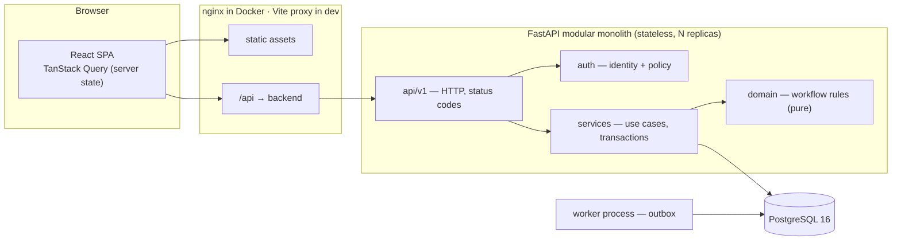
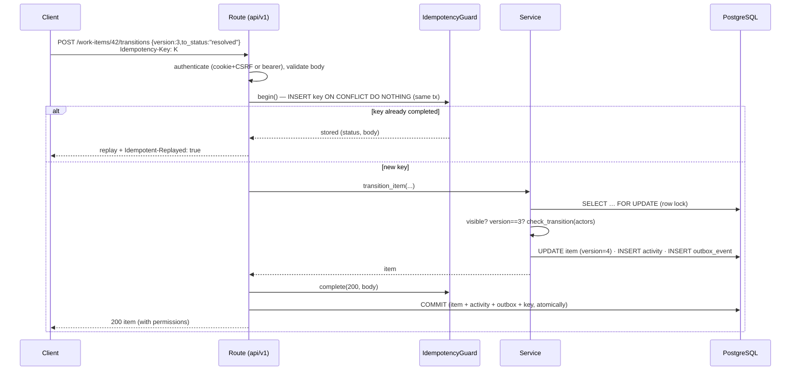
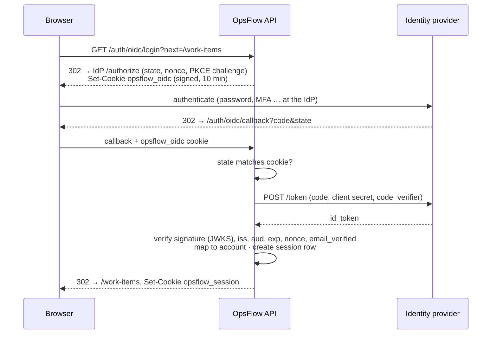

# Architecture

## 1. Overview

Style: **modular monolith** with one extra process. The browser and API share one origin (nginx or
the Vite dev proxy), so the session cookie is first-party and no CORS is involved in normal use.
Sources: `docs/diagrams/system_architecture.mmd`.

## 2. Backend layers

| Layer | Package | Responsibility | Must not |
|---|---|---|---|
| Presentation (HTTP) | `app/api/v1/*`, `app/api/common.py` | Parse/validate requests (Pydantic), call a service, commit once, map to responses | contain business rules |
| Authentication | `app/auth/deps.py`, `services/sessions.py`, `services/auth.py`, `services/throttle.py`, `services/oidc.py` | Resolve cookie/bearer token to an active server-side session; CSRF header for cookie writes; enforce temporary-password change; password login with throttling; OIDC SSO | decide permissions |
| Authorization | `app/auth/policy.py` | Team access, actor relationships, `can_*` predicates, `permissions` payload | touch HTTP |
| Business logic | `app/services/*` | Use cases: load + lock, check policy, check version, apply change, write Activity + outbox | commit |
| Domain rules | `app/domain/workflow.py` | Statuses, priorities, transition table, `check_transition` | do I/O |
| Persistence | `app/models`, `alembic/` | ORM mapping; schema, constraints, indexes, trigger | — |
| Background | `app/worker.py`, `app/services/outbox.py` | Drain outbox, retries, dead letter, key purge | block user actions |
| Cross-cutting | `app/main.py`, `app/core/*` | Config, security primitives, error envelope, request IDs, logging | — |

No separate repository layer: SQLAlchemy's `Session` already provides unit-of-work and identity
map; wrapping it in pass-through repositories would add indirection without a new seam. Queries
live in the service that owns the use case.

## 3. Request lifecycle (a state-changing request)

Any exception before `COMMIT` rolls everything back — including the idempotency key, so a retry
executes normally. Errors are mapped centrally in `main.py` to
`{"error": {"code", "message", "details"}, "request_id"}`; unexpected exceptions become a generic
500 without internals (tested).

**Transaction boundaries.** One transaction per HTTP request, committed by the route. Services
only `flush()`. The worker uses one transaction per batch with a savepoint per event, so a failing
event is recorded without losing the others' progress.

**Isolation.** PostgreSQL default READ COMMITTED plus explicit row locks / conditional updates at
the points that need them (see `docs/DATABASE_DESIGN.md §5`). This is cheaper and more explainable
than running everything SERIALIZABLE with retry loops.

## 4. Authentication and identity

- **Password sign-in**: `ensure_not_locked(email key, ip key)` → bcrypt check (always performed,
  even for unknown emails) → on failure count + security event committed separately → on success
  reset the account counter, create a session, set the cookie.
- **Every request**: token → `sid` → `sessions` row joined to `users` (active, not revoked, not
  expired) → CSRF check for cookie writes → temporary-password gate → route.
- **Revocation points**: logout, sign out one/other devices, admin "sign out everywhere",
  deactivation, admin password reset, own password change (other devices).

## 5. Authorization model

- `is_admin` (global) ⇒ acts as manager in every team, can create teams, sees outbox health.
- `TeamMembership.role ∈ {manager, member}`.
- Relationships per item: reporter, assignee.

| Action | Rule |
|---|---|
| See item / activity / comments | member of item's team, or admin — otherwise **404** |
| Create item | member of team (admin allowed); assign to others at creation: manager |
| Edit fields | reporter, assignee (while a member) or manager; not on terminal items |
| Claim | member; item unassigned and non-terminal |
| Assign / reassign | manager; target must be a team member |
| Release (unassign self) | current assignee while status is `open` |
| Transition | per edge in `TRANSITIONS` (e.g. approval = manager only) |
| Comment | member or admin; edit own comments only |
| Manage membership | team manager or admin |
| Create team, outbox health | admin |
| Manage users, security log | admin (cannot deactivate/demote self; ≥1 active admin always) |
| Own sessions and password | the user; while holding a temporary password only `/auth/*` and `/account/*` |

## 6. Frontend architecture

- **Stack:** React 19 + TypeScript (strict) + Vite + Tailwind v4 + React Router 7 + TanStack Query 5.
- **Routes:** `/login` (password + "Continue with SSO") · `/` dashboard · `/work-items` (list;
  filters in the URL) · `/work-items/new` · `/work-items/:id` · `/teams` (admins: New team) ·
  `/teams/:id` · `/account` (password, sessions) · `/admin` (users, security log, system; admins). Everything except `/login` is
  wrapped in `RequireAuth` — a UX guard, not a security boundary.
- **Structure:** `lib/api.ts` (the only HTTP code) · `components/ui` (Button, Field, Input, Select,
  Modal, Toasts, badges) · `components/layout/AppShell` · `features/<area>/` (hooks in `api.ts`,
  pages and components beside them).
- **State management:** server state lives only in the TanStack Query cache (no Redux, no copies in
  component state). Local state is limited to form drafts, modal visibility and the list's cursor
  stack. Filters are URL search params (shareable, back-button friendly).
- **Server is the source of truth:** mutations never update the UI optimistically; on success the
  cache is replaced with the server's response and dependent queries (activity, lists, dashboard)
  are invalidated; on any error the item is refetched. A click is not treated as success until the
  server says so.
- **Staleness:** item detail polls every 15 s, notifications every 20 s, dashboard every 30 s, and
  queries refetch on window focus. The edit form warns when the server version moves underneath an
  open editor and resolves 409 conflicts with a side-by-side diff (see ENGINEERING_DECISIONS §4).
- **Idempotency:** one key per user action (per form for creation); network failures are retried
  with the same key up to twice; requests without a key are never retried.
- **Validation:** client-side checks for fast feedback (required title, team, past due date);
  server 422 field errors are mapped back onto fields via `ApiError.fieldErrors()`.
- **Loading / empty / error states:** every data view has all three (`Loading`, `EmptyState`,
  `ErrorState` with retry). 401 anywhere clears the session and returns to login.
- **Accessibility:** labelled form controls, `aria-invalid` + `role="alert"` errors, `aria-pressed`
  filter chips, dialog semantics with Escape, focus-visible outlines, status shown by text and
  colour, priority by bar count and text.

## 7. Background processing

`app/worker.py` loops: `process_batch()` → claim up to 50 due events `FOR UPDATE SKIP LOCKED` →
handler per event inside a savepoint → mark processed / schedule retry (2^attempts s, capped at
300 s) / dead-letter after 5 attempts → commit. Hourly it purges expired idempotency keys. Multiple
workers can run concurrently (tested with 4 threads). The worker is optional for correctness: if
it is down, only notifications are delayed.

## 8. Scaling path

1. More API replicas behind the proxy (stateless; JWT sessions).
2. PgBouncer in transaction mode as connection counts grow.
3. Read replica for list/search/dashboard queries.
4. Cache the dashboard aggregate for a few seconds, or maintain per-team counters.
5. Partition `activities` by time; archive processed outbox rows.
6. Replace polling with SSE/websocket invalidation messages fed by the outbox.
7. Only then consider extracting services (notifications first, it is already decoupled).
